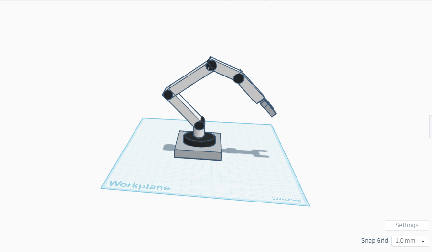

# Mechanical-engineering

## Project Title
**Design of a 5-Degree-of-Freedom Robotic Arm in Tinkercad**

---

## Objective
The goal of this project is to design a **3D robotic arm with five degrees of freedom (DOF)** using **Tinkercad**, to simulate a realistic robotic mechanism that includes rotational and joint-based motion. This model is useful for learning the fundamentals of robotic articulation and mechanical design.

---
## Description
The robotic arm is composed of five main movable sections, each representing one degree of freedom:

1. **Base Rotation (DOF 1)** 
2. **Shoulder Joint (DOF 2)** 
3. **Elbow Joint (DOF 3)** 
4. **Wrist Rotation (DOF 4)** 
5. **Gripper (DOF 5)** 

Each segment is modeled using basic geometric shapes (boxes and cylinders) and connected using simple alignment and rotation techniques in Tinkercad.

---

## Tools and Platform

- **Platform**: [Tinkercad](https://www.tinkercad.com) (Free 3D modeling tool by Autodesk)
- **Shapes Used**: Box, Cylinder

---

## Created By

- **Student Name**:  Aghadi Saleh Al-rebdi
- **University**: Qassim University  
- **Department**: Computer Science   
- **Year**: 2025

---

## Project Screenshot

Below is a screenshot of the final 3D model of the robotic arm created in Tinkercad:

